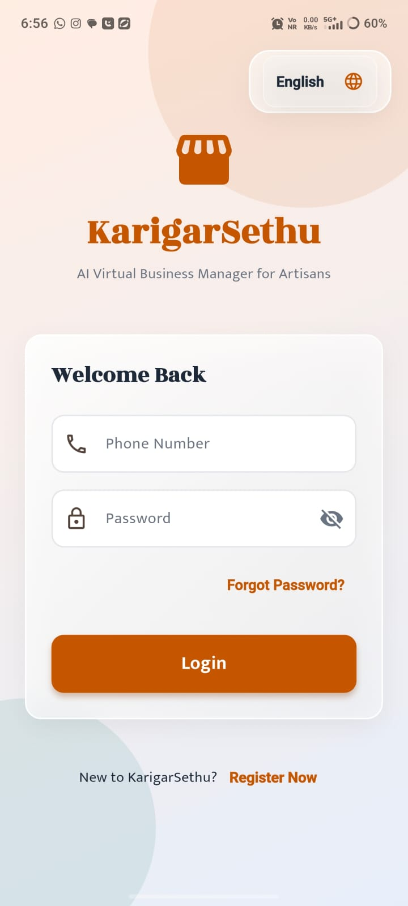
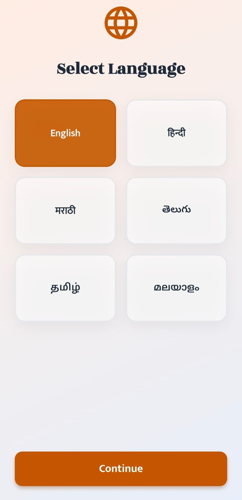
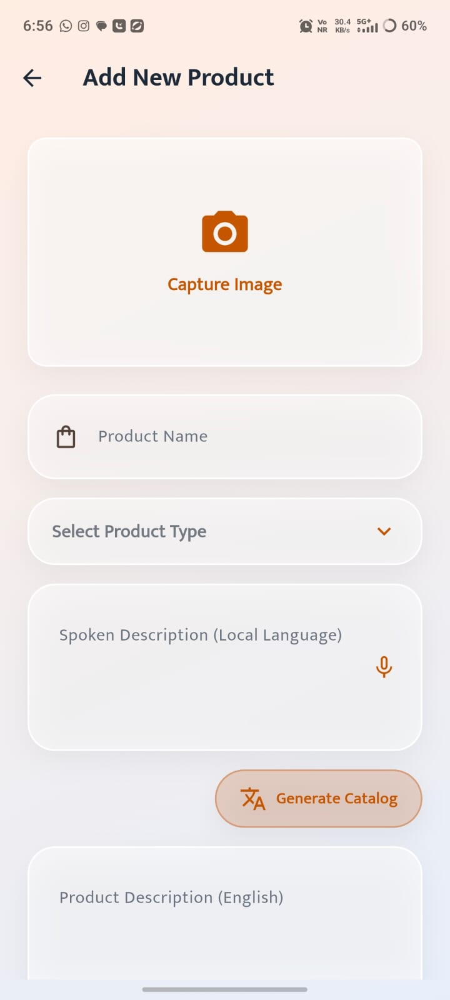

<div align="center">


# 🪡 KarigarSethu

### AI Virtual Business Manager for Artisans

**From Craft → Catalog → Pricing → Market**

<p>
  <strong>Smart India Hackathon 2026</strong>
  &nbsp;•&nbsp;
  <strong>PS ID: SIH26090</strong>
  &nbsp;•&nbsp;
  <strong>Team INNO CREW</strong>
</p>

<p>
  <a href="https://github.com/svvishva/KarigarSethu">
    
  </a>
  
  
  
  
</p>

</div>

---

# 🌟 What is KarigarSethu?

**KarigarSethu** is an AI-powered mobile application designed to help marginalized artisans move from traditional product selling to digital commerce with minimal technical effort.

Instead of requiring artisans to manually create product listings, write descriptions, translate content and determine prices, KarigarSethu combines **a product photograph + a regional-language voice description** to assist in creating a marketplace-ready product listing.

### The idea is simple:

```text
📸 Take a Product Photo
          +
🎙️ Describe the Product in Your Language
          ↓
       🤖 AI Processing
          ↓
📝 Professional Product Catalog
          +
💰 AI-Assisted Pricing
          ↓
✏️ Artisan Review & Approval
          ↓
🌐 Marketplace-Ready Listing

One product. One photo. One voice note. One complete listing.

📱 Product Preview
<div align="center">
🔐 Login & Language Selection
<table> <tr> <td align="center">  <br/> <strong>Login</strong> </td> <td align="center">  <br/> <strong>Language Selection</strong> </td> </tr> </table>
🏠 Dashboard & Product Creation
<table> <tr> <td align="center">  <br/> <strong>Dashboard</strong> </td> <td align="center">  <br/> <strong>Add Product</strong> </td> </tr> </table>
🎙️ AI Catalog Generation
<table> <tr> <td align="center">  <br/> <strong>Voice → AI Description</strong> </td> <td align="center">  <br/> <strong>Product Attributes</strong> </td> </tr> </table>
💰 Pricing Assistance
<table> <tr> <td align="center">  <br/> <strong>Pricing Assistant</strong> </td> </tr> </table> </div>
🎯 The Problem

Many artisans create high-quality traditional products but face difficulties when trying to sell them through digital marketplaces.

Challenge	KarigarSethu Approach
📸 Product photography	AI-assisted image preparation
🗣️ Language barriers	Regional-language voice input
📝 Writing product descriptions	AI-generated catalog content
🌐 Translation	Multilingual AI processing
💰 Pricing decisions	AI-assisted price recommendation
💻 Digital complexity	Simple mobile-first workflow
🏪 Market access	Marketplace-ready architecture

KarigarSethu focuses on reducing the amount of technical work required from the artisan.

✨ Core Capabilities
📸 01 — AI Image Studio

The AI Image Studio helps artisans prepare product photographs for digital commerce.

Features
Product subject segmentation
Background removal
Cleaner product presentation
Image enhancement workflow
E-commerce-oriented formatting
Edge AI processing using Google ML Kit
Processing Flow
Product Photograph
        ↓
Google ML Kit
Subject Segmentation
        ↓
Product Isolation
        ↓
Image Preparation
        ↓
E-commerce Ready Image
🎙️ 02 — Multilingual Auto-Cataloger

Artisans can describe their products naturally using a voice recording in a supported regional language.

The system converts the voice into text and uses an LLM to understand the product information.

AI Pipeline
🎙️ Artisan Voice
       ↓
Groq Whisper API
       ↓
Regional-Language Transcript
       ↓
Groq LLM / Qwen
       ↓
Product Understanding
       ↓
Attribute Extraction
       ↓
Translation & Catalog Generation
       ↓
🇬🇧 English + 🇮🇳 Hindi Listing
Generated Information
Product name
Product category
Material
Colour
Size
Design details
Product description
Search-friendly keywords
Marketplace-oriented content
Example
Artisan Voice
     ↓
"இந்த புடவை கைத்தறியில்..."
     ↓
Groq Whisper
     ↓
Text Transcription
     ↓
Groq LLM
     ↓
Product Understanding
     ↓
Professional Product Listing
🧠 03 — AI Product Intelligence

KarigarSethu extracts useful product information from the artisan's description.

The system can help identify structured attributes such as:

Product
├── Category
├── Material
├── Colour
├── Size
├── Craft Type
├── Design
├── Usage
└── Description

This reduces the amount of manual data entry required from artisans.

💰 04 — Dynamic Pricing Assistant

KarigarSethu provides an AI-assisted price recommendation using product and market-related information.

The pricing workflow can consider inputs such as:

Production cost
Raw material cost
Labour cost
Packaging cost
Product category
Market-related information
Demand-related features
Pricing Flow
Product Information
        +
Production Cost
        +
Market Features
        ↓
   Groq LLM Reasoning
        ↓
Suggested Price Range
        ↓
Artisan Review
        ↓
Final Selling Price

The suggested price is an AI recommendation.
The artisan remains in control of the final selling price.

✏️ 05 — Human-in-the-Loop

KarigarSethu is designed around artisan approval, rather than automatically publishing AI-generated information.

AI Generates
     ↓
Artisan Reviews
     ↓
Artisan Edits
     ↓
Artisan Approves
     ↓
Final Listing

This allows the artisan to correct:

Product names
Descriptions
Attributes
Translations
Prices
Product details
🌐 06 — Marketplace-Ready Architecture

The backend is designed using REST APIs so that future marketplace integrations can be added without redesigning the complete application.

Potential future integrations include:

B2B marketplaces
Government marketplace platforms
GeM-ready integration
Digital commerce platforms

Current prototype: marketplace-ready architecture
Future scope: direct marketplace/API integrations

🔄 End-to-End Product Journey
┌──────────────────────────────┐
│       👤 ARTISAN             │
└──────────────┬───────────────┘
               │
               ▼
       📸 Product Photo
               │
               ▼
      🎙️ Voice Description
               │
               ▼
┌──────────────────────────────┐
│        🤖 AI LAYER            │
│                              │
│  Google ML Kit               │
│  Groq Whisper API            │
│  Groq LLM / Qwen             │
└──────────────┬───────────────┘
               │
               ▼
      📝 Product Catalog
               │
               ▼
      💰 Price Assistance
               │
               ▼
       ✏️ Artisan Review
               │
               ▼
        ✅ Approval
               │
               ▼
       🌐 Digital Listing
🏗️ System Architecture
<div align="center">  </div>
Architecture Overview
Flutter Mobile App
        │
        ▼
   FastAPI Backend
        │
 ┌──────┼──────────────┐
 │      │              │
 ▼      ▼              ▼
ML Kit Groq          Groq
Image   Whisper       LLM
 │      │              │
 │      │              ├── Catalog Generation
 │      │              ├── Translation
 │      │              ├── Attribute Extraction
 │      │              └── Pricing Reasoning
 │      │
 └──────┴──────────────┐
                       ▼
               PostgreSQL /
                 Supabase
                       │
                       ▼
                Firebase FCM
🛠️ Technology Stack
Layer	Technology
📱 Mobile Application	Flutter / Dart
⚡ Backend	Python / FastAPI
📸 Computer Vision	Google ML Kit — Subject Segmentation
🎙️ Speech-to-Text	Groq Whisper API
🧠 Language AI	Groq API / Qwen LLM
🗄️ Database	PostgreSQL / Supabase
📦 Storage	Supabase
🔔 Notifications	Firebase Cloud Messaging
🐳 Deployment	Docker
🌐 API Architecture	REST / HTTPS
🏪 Marketplace Architecture	GeM-ready REST API design
🌍 Localization	Flutter Localization / ARB
🔧 State Management	Stateful UI / ValueNotifier
🧩 Technology Roles
Flutter

Used to build the cross-platform mobile application and user interface.

Python + FastAPI

Provides the backend API layer connecting the mobile application with AI services and the database.

Google ML Kit

Used for on-device subject segmentation for product image processing.

Groq Whisper API

Used for speech-to-text processing from artisan voice recordings.

Groq API / Qwen

Used for:

Product understanding
Translation
Attribute extraction
Catalog generation
SEO-oriented descriptions
Pricing reasoning
PostgreSQL / Supabase

Used for structured product and application data.

Firebase Cloud Messaging

Used for application notifications.

Docker

Used to package the backend for consistent deployment.

📂 Project Structure
KarigarSethu/
│
├── assets/
│   ├── logo_padded.jpeg
│   ├── login.jpeg
│   ├── select_language.jpeg
│   ├── dashboard.jpeg
│   ├── add_product.jpeg
│   ├── audio_to_description.jpeg
│   ├── add_features.jpeg
│   ├── base_price.jpeg
│   └── architecture-diagram-updated.png
│
├── frontend/
│   └── Flutter Application
│
├── backend/
│   └── FastAPI Application
│
├── README.md
└── LICENSE

The exact directory structure may evolve as development continues.

🚀 Prototype Status
<div align="center">
~40% Prototype Completed
</div>
✅ Current Prototype
Flutter mobile interface
Authentication flow
Language selection
Dashboard
Product creation workflow
Voice-based product description
Groq Whisper integration
AI catalog generation workflow
Product attribute workflow
Pricing workflow
Core application UI
Backend architecture
🔄 In Development
Complete backend integration
End-to-end AI pipeline
Production-grade image processing
Full database integration
Notification integration
Marketplace integration
Cloud deployment
End-to-end testing
🔐 Security & Data Handling

The application is being designed with security and privacy considerations from the beginning.

Current principles
API keys are stored as environment variables.
Sensitive credentials are not committed to GitHub.
Backend services act as the gateway to external AI APIs.
Authentication is handled through the application backend/authentication layer.
Database access is separated from the mobile client.
AI-generated information is reviewed by the artisan before final use.
Prototype Data Policy

The SIH prototype should use demo or synthetic data during demonstrations and testing.

Sensitive personal information such as:

Aadhaar information
Bank account details
Government confidential information
Private customer records

should not be used in the prototype demonstration.

📈 Future Roadmap
Phase 1 — Prototype
 Mobile application UI
 Product creation workflow
 Voice input workflow
 AI catalog workflow
 Pricing workflow
 Complete backend integration
Phase 2 — Production
 Production cloud deployment
 Complete image enhancement pipeline
 Notification system
 Analytics dashboard
 Robust authentication
 Performance optimization
Phase 3 — Market Connectivity
 B2B marketplace APIs
 GeM integration where applicable
 Artisan marketplace publishing
 Buyer discovery
 Order management
 Sales analytics
🌍 Expected Impact

KarigarSethu aims to reduce the digital barriers faced by artisans by simplifying several activities that are normally required to create a digital product listing.

Potential benefits
Traditional Selling
       ↓
Limited Digital Presence
       ↓
Manual Catalog Creation
       ↓
Difficulty Reaching Buyers

KarigarSethu aims to support:

Artisan
   ↓
Simple Mobile Workflow
   ↓
AI-Assisted Catalog
   ↓
AI-Assisted Pricing
   ↓
Digital Marketplace Readiness
   ↓
Larger Potential Market Access
Key impact areas
📱 Digital accessibility
📝 Reduced catalog creation effort
🌐 Multilingual commerce support
💰 Pricing assistance
🏪 Market access
🧵 Preservation and promotion of traditional crafts
🏆 Smart India Hackathon 2026
Category	Details
Problem Statement	SIH26090
Problem Title	AI-Driven Market Linkage and Smart Cataloging Mobile Application for Marginalized Artisans
Theme	Heritage & Culture
Category	Software
Team	INNO CREW
Team ID	25T
Application	KarigarSethu
🔗 Project Links
💻 GitHub

github.com/svvishva/KarigarSethu

🎥 Demo Video

Add your YouTube demonstration link here

🚀 Live Prototype

Add your deployed application/API link here

👥 Team INNO CREW
<div align="center">
Building technology for traditional artisans.

KarigarSethu

AI Virtual Business Manager for Artisans

🪡 From Craft to Commerce

Built for artisans. Designed for digital commerce.

</div>
📚 References
Smart India Hackathon 2026 — Problem Statement SIH26090
Google ML Kit Documentation
Groq API Documentation
Supabase Documentation
FastAPI Documentation
Flutter Documentation
Firebase Cloud Messaging Documentation
<div align="center">

⭐ If you find this project interesting, consider starring the repository.

KarigarSethu • INNO CREW • SIH 2026

</div> ```
