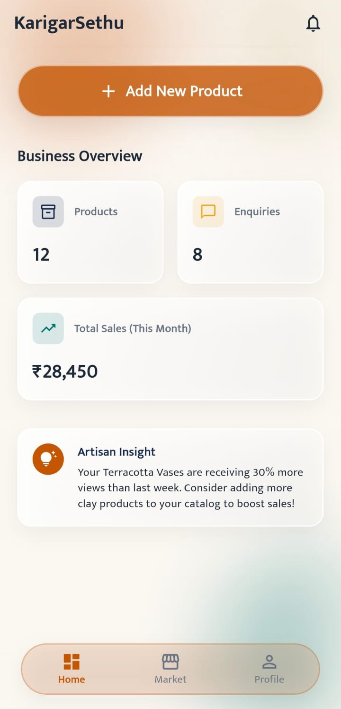
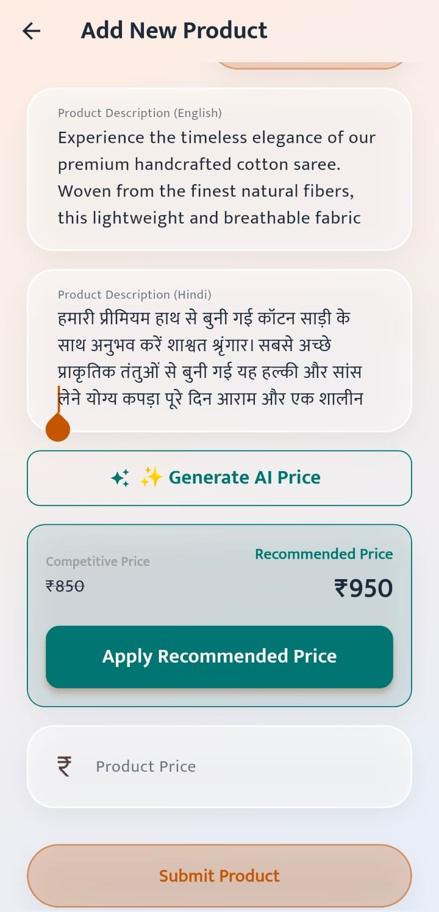
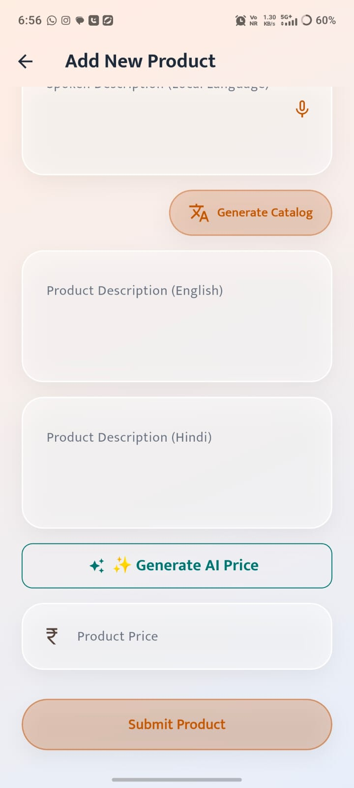
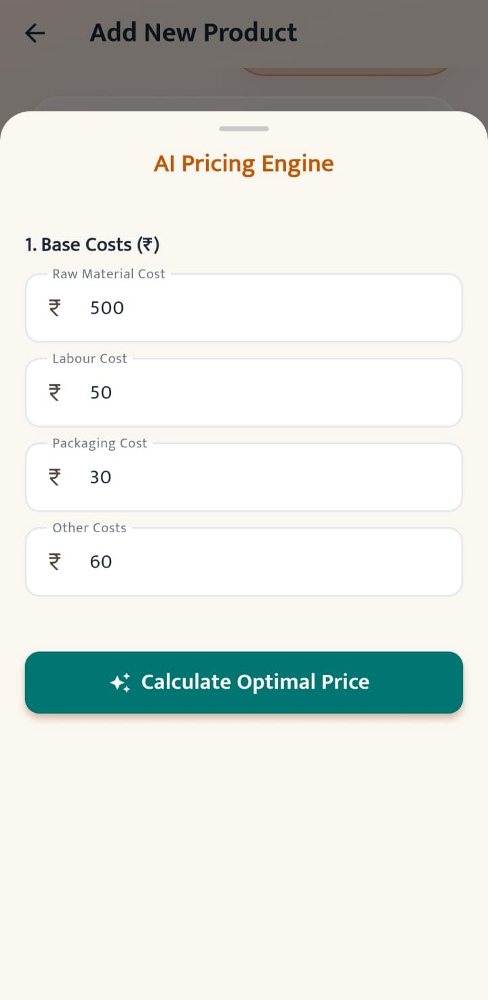
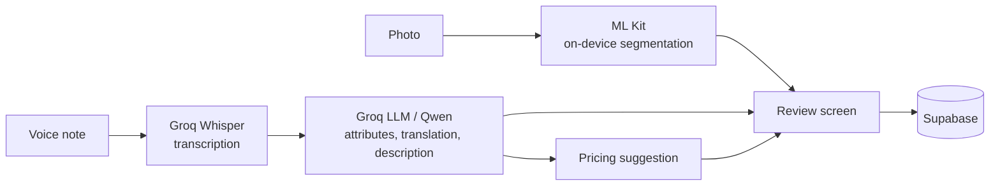
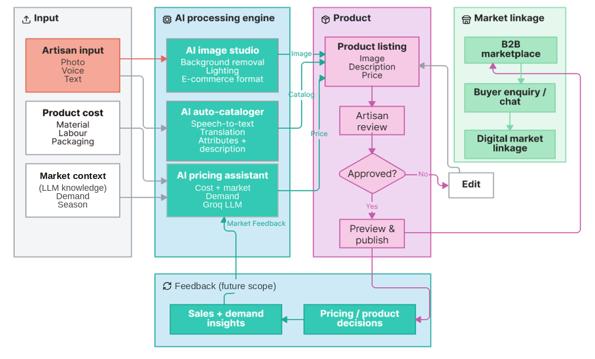

<p align="center">
  
</p>

<h1 align="center">KarigarSethu</h1>

<p align="center">
  A voice-first mobile app that turns a photo and a spoken description into a marketplace-ready product listing, in the artisan's own language.
</p>

<p align="center">
  Smart India Hackathon 2026 · PS SIH26090 · Team Sethu (ID 177907)
</p>

<p align="center">
  
  
  
  
  
</p>

<p align="center">
  
  
  
  
</p>

---

## The problem

Many artisans make excellent work and still sell only locally. Listing a single product online means taking a clean photo, writing a description, translating it, choosing a category and attributes, and deciding a price. That is a lot of work in a language and interface many artisans are not comfortable with.

The problem statement (SIH26090) asks for AI-driven market linkage and smart cataloging for marginalized artisans. We took the narrowest useful slice of that: **make creating one good listing take a minute, not an afternoon.**

<!-- TODO: add 2-3 sentences on how your team came to this idea (who you spoke to, what you observed, why crafts matter to you). Real context here is what makes a README feel like yours. -->

## What it does

An artisan photographs a product and describes it out loud in their own language. KarigarSethu then:

1. Cleans up the photo by isolating the product from its background.
2. Transcribes the voice note.
3. Extracts structured details (product, category, material, colour, size, design, usage).
4. Writes a listing in English and Hindi, with search keywords.
5. Suggests a price range from the artisan's costs and market features.
6. Shows everything to the artisan to edit and approve before anything is saved as final.

## How it works



The Flutter app talks only to our FastAPI backend. The backend calls the AI services and the database.

<p align="center">
  
</p>

## Design decisions

**The artisan approves everything.** Generated names, descriptions, translations and prices are drafts. A wrong translation or an unrealistic price could cost an artisan a sale, so nothing is treated as final until they confirm it.

**Pricing is a suggestion, not a verdict.** The model returns a range with reasoning based on the artisan's own cost inputs. The final price is always theirs.

**Segmentation runs on the device.** Using Google ML Kit for background removal keeps image processing off the network and avoids uploading raw photos just to clean them.

**API keys never touch the app.** The mobile client calls our backend only. The backend holds the keys as environment variables and is the single gateway to Groq and Supabase.

**REST from the start.** Marketplace integrations (B2B platforms, GeM) are a future goal, so the backend is structured so they can be added as new endpoints rather than a rewrite.

<!-- TODO: edit the reasons above so they match your team's real thinking. Add any decision you debated (e.g. why Groq, why Flutter). -->

## Tech stack

| Area | Choice |
|---|---|
| Mobile | Flutter (Dart), Flutter localization (ARB), ValueNotifier for state |
| Backend | Python, FastAPI, Docker |
| Vision | Google ML Kit subject segmentation |
| Speech-to-text | Groq Whisper API |
| Language model | Groq API with Qwen |
| Data | PostgreSQL on Supabase (database and storage) |
| Notifications | Firebase Cloud Messaging |

## Status

The prototype is roughly 40% complete. We would rather be clear about that than overstate it.

| Working | In progress |
|---|---|
| Login, language selection, dashboard | Full backend integration of the AI pipeline |
| Product creation flow | Production-quality image processing |
| Voice description with Groq Whisper | Complete database integration |
| Catalog generation workflow | Push notifications |
| Attribute and pricing workflows | Marketplace integration |
| Backend architecture | Cloud deployment and end-to-end testing |

## Running it locally

You will need the Flutter SDK, Python 3.10+, a Groq API key and a Supabase project.

```bash
git clone https://github.com/svvishva/KarigarSethu.git
cd KarigarSethu
```

Backend:

```bash
cd backend
python -m venv venv && source venv/bin/activate   # Windows: venv\Scripts\activate
pip install -r requirements.txt
```

Create `backend/.env`:

```env
GROQ_API_KEY=...
SUPABASE_URL=...
SUPABASE_KEY=...
```

```bash
uvicorn main:app --reload
```

App:

```bash
cd frontend
flutter pub get
flutter run
```

<!-- TODO: verify these commands, the entry file name and the .env variable names against your actual backend. -->

## Known limitations

- The image enhancement pipeline is not yet production quality.
- Pricing suggestions depend on the quality of the cost and market inputs; we have not validated them against real marketplace data yet.
- Transcription and translation accuracy across regional languages and dialects still needs testing with real artisan recordings.
- Demo data only. We do not use Aadhaar, bank details or private customer records in the prototype.

<!-- TODO: keep this section honest and specific. Judges tend to trust teams that know their weak spots. -->

## Roadmap

- **Next:** finish the end-to-end pipeline, database integration and notifications; test with real voice samples.
- **Then:** cloud deployment, analytics dashboard, stronger authentication.
- **Later:** B2B marketplace APIs, GeM integration where applicable, buyer discovery, order management.

## Links

- Repository: [github.com/svvishva/KarigarSethu](https://github.com/svvishva/KarigarSethu)
- Demo video: [youtube.com/shorts/rkIRY6c0-qM](https://youtube.com/shorts/rkIRY6c0-qM?feature=share)
 <!-- TODO: add link -->

## Team Sethu

<!-- TODO: add members, roles and GitHub handles -->

## License

See [LICENSE](LICENSE).
