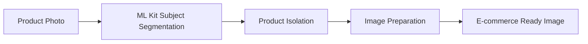
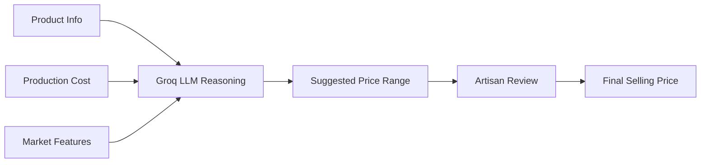
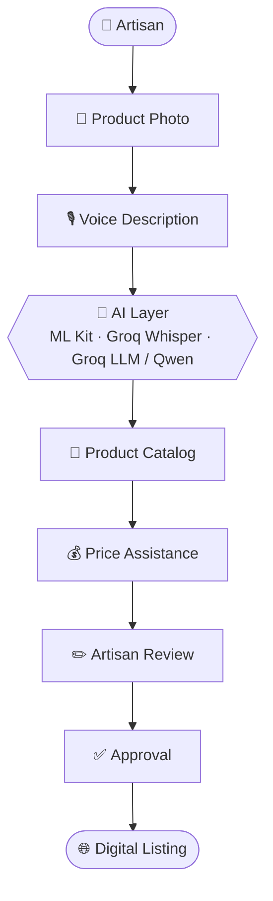
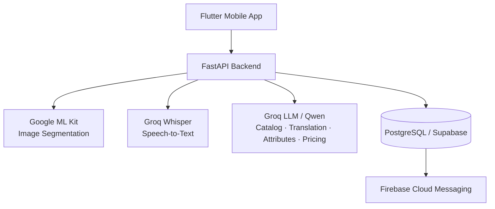

<div align="center">


# 🪡 KarigarSethu

### AI Virtual Business Manager for Artisans

**From Craft → Catalog → Pricing → Market**

*One product. One photo. One voice note. One complete listing.*

<p>
  
  
  
  
</p>

<p>
  
  
  
  
  
  
</p>

<p>
  <a href="#-overview">Overview</a> •
  <a href="#-product-preview">Preview</a> •
  <a href="#-core-features">Features</a> •
  <a href="#-system-architecture">Architecture</a> •
  <a href="#-tech-stack">Tech Stack</a> •
  <a href="#-getting-started">Getting Started</a> •
  <a href="#-roadmap">Roadmap</a>
</p>

</div>

---

## 🌟 Overview

**KarigarSethu** ("the artisan's bridge") is an AI-powered mobile app that helps marginalized artisans move from traditional selling to digital commerce with minimal technical effort.

Instead of asking artisans to manually write listings, translate content and guess prices, KarigarSethu combines **a product photograph + a regional-language voice description** to produce a marketplace-ready listing, which the artisan reviews and approves.

```text
📸 Product Photo  +  🎙️ Voice Description (regional language)
                        ↓
                  🤖 AI Processing
                        ↓
        📝 Catalog  +  💰 AI-Assisted Pricing
                        ↓
            ✏️ Artisan Review & Approval
                        ↓
               🌐 Marketplace-Ready Listing
```

---

## 🎯 The Problem

Many artisans create exceptional traditional products but struggle to sell them online.

| Challenge | KarigarSethu Approach |
|---|---|
| 📸 Product photography | AI-assisted image preparation |
| 🗣️ Language barriers | Regional-language voice input |
| 📝 Writing descriptions | AI-generated catalog content |
| 🌐 Translation | Multilingual AI processing (English + Hindi output) |
| 💰 Pricing decisions | AI-assisted price recommendation |
| 💻 Digital complexity | Simple, mobile-first workflow |
| 🏪 Market access | Marketplace-ready REST architecture |

---

## 📱 Product Preview

<div align="center">

### 🔐 Login & Language Selection

<table>
  <tr>
    <td align="center"><br/><b>Login</b></td>
    <td align="center"><br/><b>Language Selection</b></td>
  </tr>
</table>

### 🏠 Dashboard & Product Creation

<table>
  <tr>
    <td align="center"><br/><b>Dashboard</b></td>
    <td align="center"><br/><b>Add Product</b></td>
  </tr>
</table>

### 🎙️ AI Catalog Generation

<table>
  <tr>
    <td align="center"><br/><b>Voice → AI Description</b></td>
    <td align="center"><br/><b>Product Attributes</b></td>
  </tr>
</table>

### 💰 Pricing Assistance

<table>
  <tr>
    <td align="center"><br/><b>Pricing Assistant</b></td>
  </tr>
</table>

</div>

---

## ✨ Core Features

### 📸 1. AI Image Studio

Prepares product photos for digital commerce using on-device processing.

- Product subject segmentation and background removal
- Cleaner, e-commerce-oriented product presentation
- On-device processing with **Google ML Kit**



### 🎙️ 2. Multilingual Auto-Cataloger

Artisans describe their product naturally in a supported regional language. The voice note is transcribed and an LLM turns it into a structured, bilingual listing.


**Generated fields:** product name · category · material · colour · size · design details · description · search keywords · marketplace-oriented copy

### 🧠 3. AI Product Intelligence

Extracts structured attributes from the artisan's description to reduce manual data entry.

```text
Product
├── Category
├── Material
├── Colour
├── Size
├── Craft Type
├── Design
├── Usage
└── Description
```

### 💰 4. Dynamic Pricing Assistant

Suggests a price range from product details, costs and market-related signals.

- **Inputs:** production cost, raw material, labour, packaging, category, market and demand-related features
- **Output:** a suggested price *range* with reasoning



> **The suggested price is a recommendation only. The artisan always controls the final selling price.**

### ✏️ 5. Human-in-the-Loop

Nothing is published automatically. The artisan can review and edit:

- Product names and descriptions
- Attributes and translations
- Prices and other product details

```text
AI Generates → Artisan Reviews → Artisan Edits → Artisan Approves → Final Listing
```

### 🌐 6. Marketplace-Ready Architecture

The REST backend is designed so new marketplace integrations can be added without redesigning the app.

| | |
|---|---|
| **Current prototype** | Marketplace-ready architecture |
| **Future scope** | B2B marketplaces, GeM-ready integration, other digital commerce platforms |

---

## 🔄 End-to-End Journey



---

## 🏗️ System Architecture

<div align="center">
  
</div>



---

## 🛠️ Tech Stack

| Layer | Technology | Role |
|---|---|---|
| 📱 Mobile App | Flutter / Dart | Cross-platform UI |
| ⚡ Backend | Python / FastAPI | API layer between app, AI services and database |
| 📸 Computer Vision | Google ML Kit | On-device subject segmentation |
| 🎙️ Speech-to-Text | Groq Whisper API | Transcribes artisan voice recordings |
| 🧠 Language AI | Groq API / Qwen LLM | Understanding, translation, attribute extraction, catalog, SEO copy, pricing reasoning |
| 🗄️ Database & Storage | PostgreSQL / Supabase | Structured data and file storage |
| 🔔 Notifications | Firebase Cloud Messaging | App notifications |
| 🐳 Deployment | Docker | Consistent backend packaging |
| 🌐 API Design | REST / HTTPS, GeM-ready | Marketplace-ready integration |
| 🌍 Localization | Flutter Localization / ARB | Multi-language UI |
| 🔧 State Management | Stateful UI / ValueNotifier | Client state |

---

## 🚀 Prototype Status

<div align="center">

**~40% of the prototype is complete**


</div>

| ✅ Completed | 🔄 In Development |
|---|---|
| Flutter mobile interface | Complete backend integration |
| Authentication flow | End-to-end AI pipeline |
| Language selection | Production-grade image processing |
| Dashboard | Full database integration |
| Product creation workflow | Notification integration |
| Voice-based product description | Marketplace integration |
| Groq Whisper integration | Cloud deployment |
| AI catalog generation workflow | End-to-end testing |
| Product attribute workflow | |
| Pricing workflow | |
| Core application UI | |
| Backend architecture | |

---

## ⚙️ Getting Started

> ⚠️ The project is under active development. Steps below may change as the codebase evolves.

### Prerequisites

- [Flutter SDK](https://docs.flutter.dev/get-started/install)
- Python 3.10+
- A [Groq API key](https://console.groq.com/)
- A [Supabase](https://supabase.com/) project
- Docker *(optional)*

### 1. Clone the repository

```bash
git clone https://github.com/svvishva/KarigarSethu.git
cd KarigarSethu
```

### 2. Run the backend

```bash
cd backend
python -m venv venv
source venv/bin/activate          # Windows: venv\Scripts\activate
pip install -r requirements.txt
```

Create a `.env` file in `backend/` (never commit this file):

```env
GROQ_API_KEY=your_groq_api_key
SUPABASE_URL=your_supabase_url
SUPABASE_KEY=your_supabase_key
```

Start the server:

```bash
uvicorn main:app --reload
```

### 3. Run the mobile app

```bash
cd frontend
flutter pub get
flutter run
```

### 4. Run with Docker *(optional)*

```bash
docker build -t karigarsethu-backend ./backend
docker run --env-file backend/.env -p 8000:8000 karigarsethu-backend
```

<!-- TODO: confirm the entry file (main:app), requirements.txt and port match your backend before publishing. -->

---

## 📂 Project Structure

```text
KarigarSethu/
├── assets/                  # Logo, screenshots, architecture diagram
├── frontend/                # Flutter application
├── backend/                 # FastAPI application
├── README.md
└── LICENSE
```

*The exact structure may evolve as development continues.*

---

## 🔐 Security & Data Handling

- API keys are stored as environment variables and never committed to GitHub
- The backend is the gateway to external AI APIs; the mobile client never calls them directly
- Authentication is handled through the backend/authentication layer
- Database access is separated from the mobile client
- AI-generated content is always reviewed by the artisan before use

**Prototype data policy:** demos and testing use demo or synthetic data only. Do **not** use Aadhaar details, bank account details, confidential government information or private customer records.

---

## 📈 Roadmap

**Phase 1 — Prototype**
- [x] Mobile application UI
- [x] Product creation workflow
- [x] Voice input workflow
- [x] AI catalog workflow
- [x] Pricing workflow
- [ ] Complete backend integration

**Phase 2 — Production**
- [ ] Cloud deployment
- [ ] Complete image enhancement pipeline
- [ ] Notification system
- [ ] Analytics dashboard
- [ ] Robust authentication
- [ ] Performance optimization

**Phase 3 — Market Connectivity**
- [ ] B2B marketplace APIs
- [ ] GeM integration where applicable
- [ ] Artisan marketplace publishing
- [ ] Buyer discovery
- [ ] Order management
- [ ] Sales analytics

---

## 🌍 Expected Impact

| Area | Benefit |
|---|---|
| 📱 Digital accessibility | Simple mobile workflow, no technical skills needed |
| 📝 Catalog effort | Far less manual listing work |
| 🌐 Multilingual commerce | Regional voice in, English + Hindi listing out |
| 💰 Pricing | Guidance for fairer, better-informed prices |
| 🏪 Market access | Marketplace-ready listings for wider reach |
| 🧵 Heritage | Preservation and promotion of traditional crafts |

---

## 🏆 Smart India Hackathon 2026

| | |
|---|---|
| **Problem Statement** | SIH26090 |
| **Problem Title** | AI-Driven Market Linkage and Smart Cataloging Mobile Application for Marginalized Artisans |
| **Theme** | Heritage & Culture |
| **Category** | Software |
| **Team** | INNO CREW |
| **Team ID** | 25T |
| **Application** | KarigarSethu |

---

## 🔗 Project Links

| | |
|---|---|
| 💻 **GitHub** | [github.com/svvishva/KarigarSethu](https://github.com/svvishva/KarigarSethu) |
| 🎥 **Demo Video** | *Coming soon* |
| 🚀 **Live Prototype** | *Coming soon* |

---

## 👥 Team INNO CREW

<!-- Add your team members here, e.g.:
| Name | Role | GitHub |
|---|---|---|
| Your Name | Team Lead / Full-Stack | [@svvishva](https://github.com/svvishva) |
-->

*Building technology for traditional artisans.*

---

## 🤝 Contributing

Contributions, issues and feature suggestions are welcome. Feel free to open an [issue](https://github.com/svvishva/KarigarSethu/issues) or submit a pull request.

## 📄 License

Distributed under the terms of the [LICENSE](LICENSE) file.

## 📚 References

- Smart India Hackathon 2026 — Problem Statement SIH26090
- [Google ML Kit](https://developers.google.com/ml-kit)
- [Groq API](https://console.groq.com/docs)
- [Supabase](https://supabase.com/docs)
- [FastAPI](https://fastapi.tiangolo.com/)
- [Flutter](https://docs.flutter.dev/)
- [Firebase Cloud Messaging](https://firebase.google.com/docs/cloud-messaging)

<div align="center">

---

### 🪡 From Craft to Commerce

**Built for artisans. Designed for digital commerce.**

⭐ If you find this project interesting, consider starring the repository.

**KarigarSethu** • INNO CREW • SIH 2026

</div>
